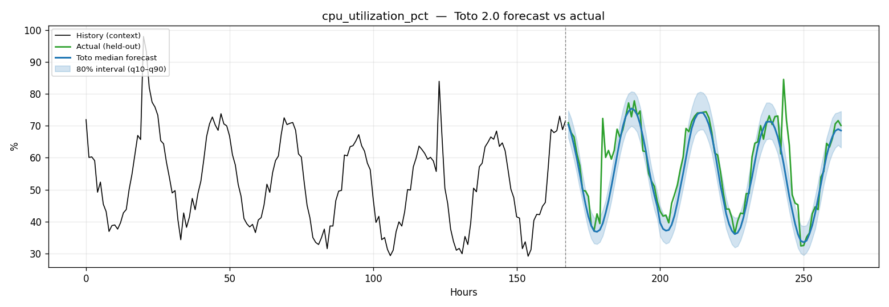

# Toto 2.0 — Observability Metrics Forecasting POC

End-to-end proof of concept using **[DataDog/Toto](https://github.com/DataDog/toto)**,
a foundation model purpose-built for forecasting **observability metrics**, applied
to synthetic AIOps-style signals (CPU utilization, p95 request latency, request rate).

This POC demonstrates the full loop you'd run against a real Grafana LGTM /
Prometheus stack — generate signal → forecast horizon → score against ground
truth → visualize — entirely offline and reproducible on CPU.

## What it does

1. **Generate** 3 synthetic observability metrics at hourly resolution, each with a
   baseline, daily + weekly seasonality, slow trend, noise, and incident-like spikes.
2. **Split** every series into a 512-step context window and a held-out 96-step
   (4-day) forecast horizon.
3. **Forecast** all metrics *multivariately* with the Toto 2.0 model
   (`Datadog/Toto-2.0-22m` by default).
4. **Score** the median forecast vs. the held-out actuals — MAE, RMSE, sMAPE,
   and 80% prediction-interval coverage.
5. **Save** per-metric plots and a JSON report to [`outputs/`](outputs/).

## Why Toto

Toto 2.0 is a transformer with alternating **time/variate attention**, trained on
real Datadog observability telemetry and benchmarked on **BOOM** (Benchmark of
Observability Metrics). It is a zero-shot forecaster — no training or fine-tuning
needed for this POC. Model sizes: `4m | 22m | 313m | 1B | 2.5B`.

## Quick start

```bash
python3 -m venv .venv && source .venv/bin/activate
pip install -r requirements.txt          # installs Toto + torch
python run_poc.py --size 22m --horizon 96
```

> First run downloads the Toto checkpoint from HuggingFace. Runs CPU-only;
> a GPU (Ampere+) is faster but not required for the small models.

### CLI options

| Flag | Default | Meaning |
|------|---------|---------|
| `--size` | `22m` | Toto 2.0 model size (`4m`/`22m`/`313m`/`1B`/`2.5B`) |
| `--context` | `512` | History window length (hourly steps) |
| `--horizon` | `96` | Forecast horizon (96 = 4 days) |
| `--seed` | `42` | RNG seed for the synthetic data |

## Project layout

```
toto-observability-poc/
├── run_poc.py            # end-to-end pipeline (entry point)
├── requirements.txt
├── src/
│   ├── synthetic.py      # synthetic observability metric generator
│   ├── forecaster.py     # Toto 2.0 wrapper (forecast → quantiles)
│   ├── metrics.py        # MAE / RMSE / sMAPE / interval coverage
│   └── plotting.py       # actual-vs-forecast charts
└── outputs/              # generated plots + report.json
```

## Output

`outputs/report.json` — model info, per-metric scores, aggregate sMAPE & coverage.
`outputs/forecast_<metric>.png` — history + actual + median forecast + 80% band.

## Results (reproduced run — `Toto-2.0-22m`, CPU, zero-shot)

512h context → 96h (4-day) horizon, 3 metrics forecast multivariately.
Checkpoint load 40.8s; **inference 1.07s** for all 3 series.

| Metric | sMAPE | MAE | 80% interval coverage |
|--------|------:|----:|----------------------:|
| `cpu_utilization_pct` | 7.51% | 4.04 | 0.77 |
| `request_latency_p95_ms` | 9.23% | 16.22 | 0.73 |
| `request_rate_rps` | 2.89% | 25.32 | 0.97 |
| **Aggregate** | **6.54%** | — | **0.82** (ideal ~0.80) |

Zero-shot, no fine-tuning. The model recovers daily seasonality + trend and
its 80% band is well-calibrated (0.82 vs. nominal 0.80). See
[`outputs/`](outputs/) for plots and `report.json`.



## Extending to real data

Swap `src/synthetic.generate_dataset()` for a Prometheus/Mimir range query
(`/api/v1/query_range`) returning an `(n_var, time)` array; the rest of the
pipeline (forecast → score → plot) is unchanged.

---
Toto is © Datadog, Apache-2.0. This POC code is provided as-is for evaluation.
